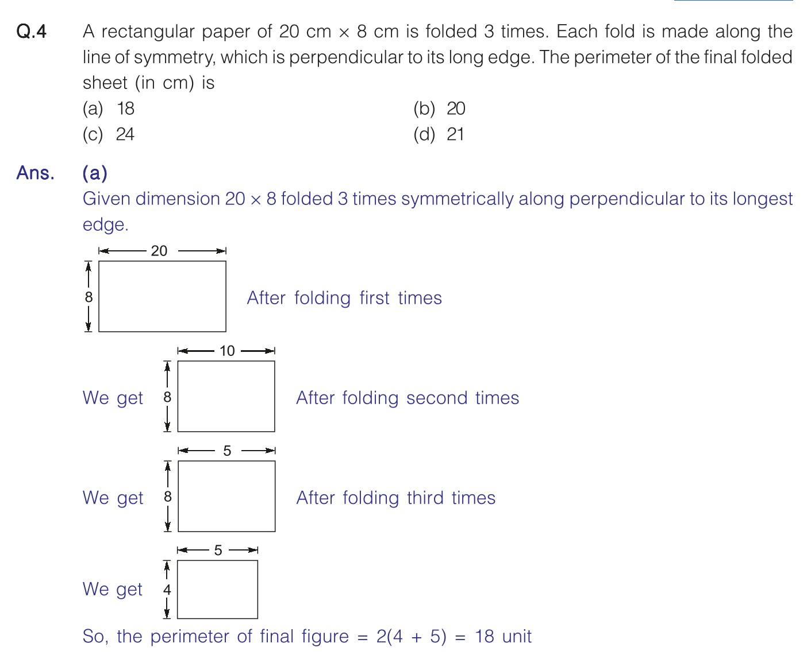
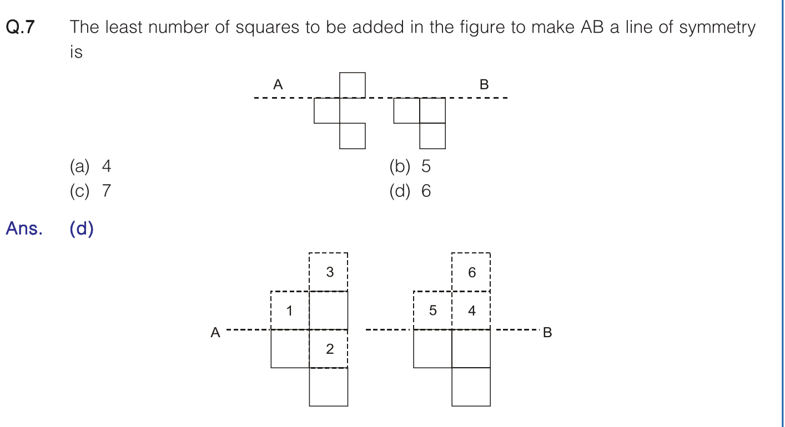
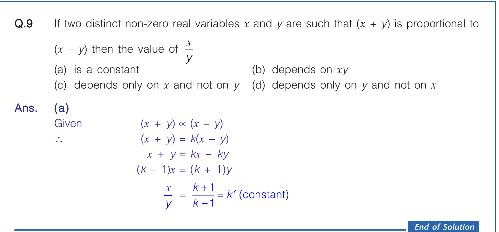
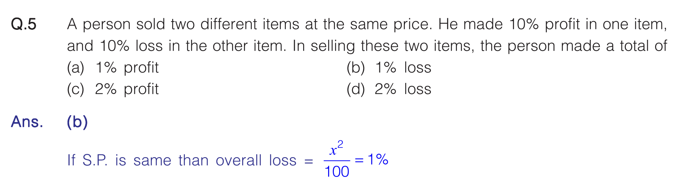
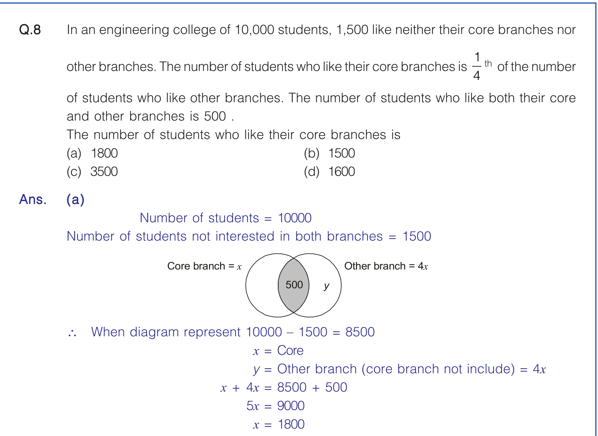

# 

| Property       | Formula                                   |
| -------------- | ----------------------------------------- |
| Product        | (\log_a(xy)=\log_a x+\log_a y)            |
| Quotient       | (\log_a(x/y)=\log_a x-\log_a y)           |
| Power          | (\log_a(x^n)=n\log_a x)                   |
| Root           | (\log_a(\sqrt[n]{x})=\frac{1}{n}\log_a x) |
| Change of Base | (\log_a x=\frac{\log_b x}{\log_b a})      |
| Log of 1       | (\log_a1=0)                               |
| Log of Base    | (\log_aa=1)                               |
| Inverse        | (\log_a(a^x)=x,\quad a^{\log_a x}=x)      |
| Equality       | (\log_a x=\log_a y\Rightarrow x=y)        |
| Reciprocal     | (\log_a x=\frac{1}{\log_x a})             |

# GOOD Q's :

1. 

2. 

3. 

4. 

- Whenever:
> Two items are sold at the same selling price
> Profit = Loss = x%

- OR 
    - find CP1 and CP2 in terms of each other and assume one and get other.
    - find 2SP-CP1-CP2

5. 

> ∣A∪B∣=∣A∣+∣B∣−∣A∩B∣

